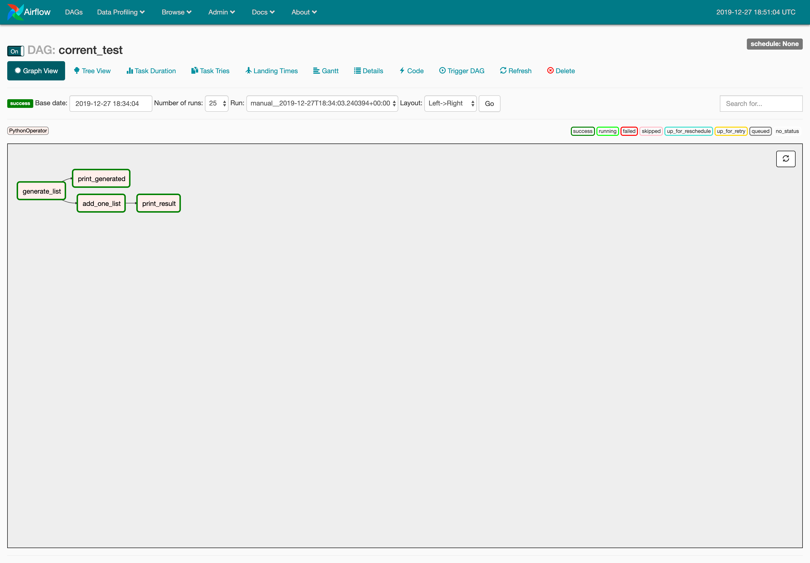

# Corrent: Functional Airflow

Corrent is an Airflow functional DAG API. 

## Purpose

This is an experiment of mine to come up with an alternative API that make Data pipelines on Airflow easier by abstracting away some XCom operations and PythonOperator operations. 

**Fun fact**: Less than 200 lines of code under _[corrent](corrent)_ folder, take a peak 👀

## Next steps

- Add unit tests
- Create DAG using a more complex operator together with the `operation` operators and several xcom arguments.
- Add template compatibility on `XComArg` (understand better how to do it)
- Explore making an abstraction on top of PySpark that caches, and passes references to the stored datasets in the same session (needs to dig deeper)

## Features
- Functional extension for Airflow DAGs.
- Compatible with existing Airflow DAGs.
- Adds implicit XCom data dependencies.
- Simplify XCom pulls needed for `pre_execute` or `execute`.
- Simple `PythonOperator` creation using `operation` decorators on functions.
- Copy operators generated using `operation` decorators with `copy_operation` helper function.

## Example

Here's an example DAG with Corrent Functional API. This will compile on Airflow and will discover implicit dependencies. Make sure to have `corrent` installed or on your `PYTHONPATH` when starting Airflow's webserver, scheduler and workers. 

```python
from airflow import DAG

from corrent.decorators import operation, copy_operation
from corrent.core import inject

inject()


with DAG("corrent_test", schedule_interval=None) as dag:
  @operation
  def generate_list(length: int = 5) -> List[int]:
    return list(range(length))


  @operation
  def add_one_list(int_list: List[int]) -> List[int]:
    return [i + 1 for i in int_list]


  @operation
  def print_result(result: List[int]) -> None:
    print(result)

  l = generate_list(10)

  print_generated = print_result.copy('print_generated')
  print_generated(l)

  l1 = add_one_list(l)

  print_result(l1)

  print_result << print_generated
```

[View example DAGs here](dags/)

### DAG on Airflow UI



## Development environment
Requirements: `python3.7`, `pipenv`

1. `pipenv install`
2. `pipenv shell`
